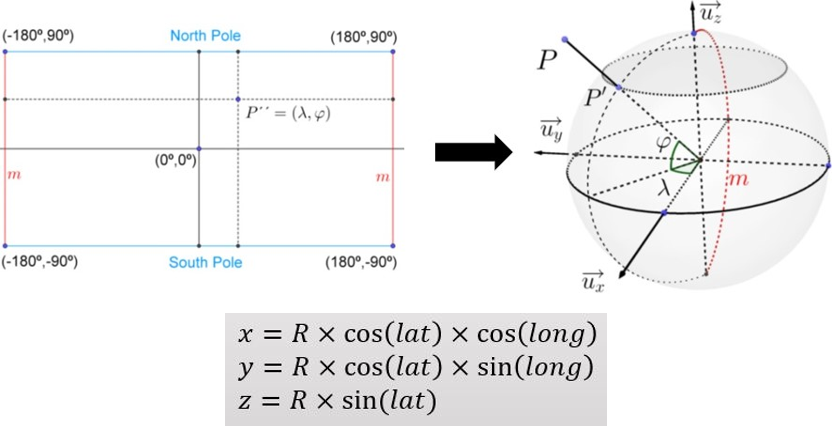

# Equirectangular-rotate

## Theory
### Transform Longitute-Latitute into Spherical Coordinate

### Transform Spherical Coordinate into Longitute-Latitute


## Usage
```
positional arguments:
  file_path          file path
  X                  x rotation value
  Y                  y rotation value
  Z                  z rotation value
  outfile_name       output file name

optional arguments:
  -h, --help         show this help message and exit
  --isInverse ISINVERSE  Inverse Transformation. True or False
  --unit UNIT        degree or rad, default unit is degree
```

```
python main.py [-h] [--isInverse ISINVERSE] [--unit UNIT] file_path X Y Z outfile_name
```

for example
```
python main.py equirect-test.png 45 45 45 out_img.png
```

`main_with_time.py` is provided in `/testbench/` folder

## Performance
- **Original Image**


- **x - 45°, y - 45°, z - 45°**


- **x - 180°, y - 0, z - 0**
